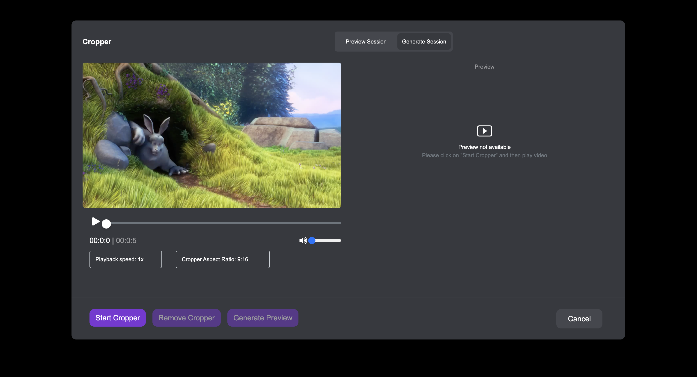
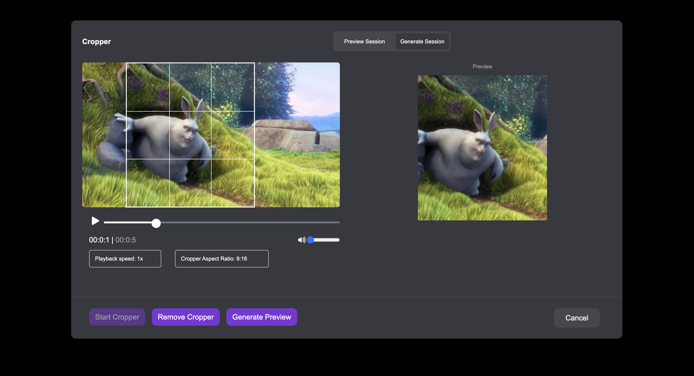

### Objective:

Build a **Dynamic Flip Screen** that allows users to crop video content dynamically. This involves integrating a video player, overlaying a cropper layer with multiple aspect ratios, and providing a dynamic preview of the cropped segment.

## Tech Used
1. HTML
2. CSS
3. Bootstrap (only for UI)
4. Plain javascript

##  Feature

1. **Video Player Integration:**
    - **Static Media Content:** Implement a video player to display static media content (use a 16:9 aspect ratio media file)
    - **Playback Controls:** Ensure the video player supports play, pause, and seek.
    - **Playback Rate Control:** Allow users to control playback speed (0.5x, 1x, 1.5x, 2x).
    - **Volume Control:** Provide volume control options.
2. **Cropper Layer:**
    - **Overlay:** Overlay a cropper layer on top of the video player.
    - **Aspect Ratios:** Support multiple aspect ratios:  9:18, 9:16, 4:3, 3:4, 1:1, 4:5.
    - **Movable and Resizable:** The cropper should be movable and resizable within the video player. It should occupy 100% of the video player's height.
    - **Constraints:** Ensure the cropper stays within the video player's dimensions.
3. **Dynamic Preview:**
    - **Real-Time Update:** Display a dynamic preview of the cropped segment in a designated area on the right.
    - **Aspect Ratio Matching:** The preview must match the cropper's aspect ratio and be within a fixed height and width container. The parent container's (Modal) height should not change with the cropper’s aspect ratio.
    - **Synchronisation:** Ensure real-time updates with negligible delay between the video player and the preview

4. **UI and Functionality:**
Coordinates Recording: Record the cropper's coordinates, time elapsed, volume, and playback rate at multiple points in time.